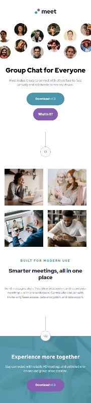
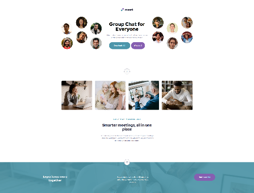

# Frontend Mentor - Meet landing page solution

This is a solution to the [Meet landing page challenge on Frontend Mentor](https://www.frontendmentor.io/challenges/meet-landing-page-rbTDS6OUR). Frontend Mentor challenges help you improve your coding skills by building realistic projects.

## Table of contents

- [Overview](#overview)
  - [The challenge](#the-challenge)
  - [Screenshot](#screenshot)
  - [Links](#links)
- [My process](#my-process)
  - [Built with](#built-with)
  - [Continued development](#continued-development)
- [Author](#author)

## Overview

### The challenge

Users should be able to:

- View the optimal layout depending on their device's screen size
- See hover states for interactive elements

### Screenshots

### Links

- Live Site URL: [https://vue-meet-landing-page.vercel.app/](https://vue-meet-landing-page.vercel.app/)
- Solution URL: [https://www.frontendmentor.io/solutions/vue-meet-landing-page-f53Qnyn5K](https://www.frontendmentor.io/solutions/vue-meet-landing-page-f53Qnyn5K)

## My process

### Built with

- Semantic HTML5 markup
- Tailwind-CSS
- Flexbox
- CSS Grid
- Mobile-first workflow
- [Vue.js](https://vuejs.org/) - The Progressive JavaScript Framework

### Continued development

The next steps are the implementation of headless cms, the integration of storyblok, and gsap.

## Author

- Website - [Andreas Schwarz](https://andreas-schwarz.dev/)
- LinkedIn - [Andreas Schwarz](https://www.linkedin.com/in/andreas-schwarz-20/)
- Frontend Mentor - [@Schwarzbaer2](https://www.frontendmentor.io/profile/Schwarzbaer2)
